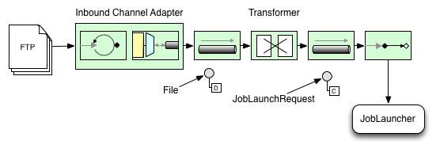
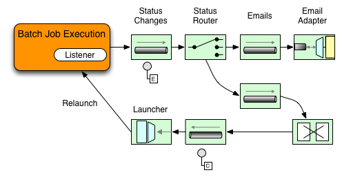
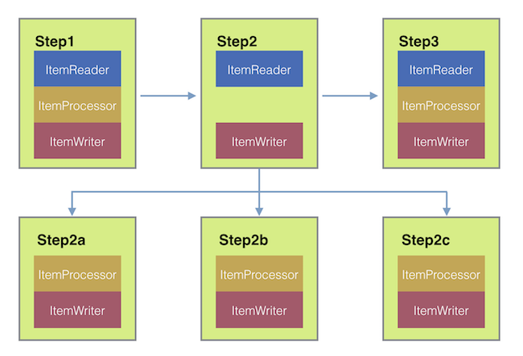
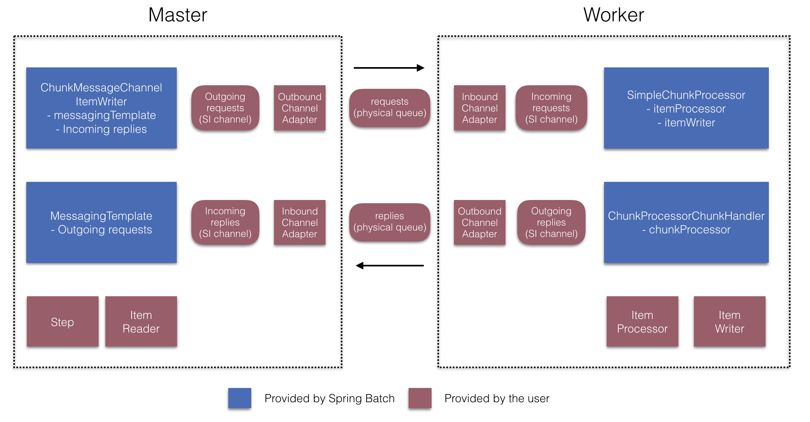
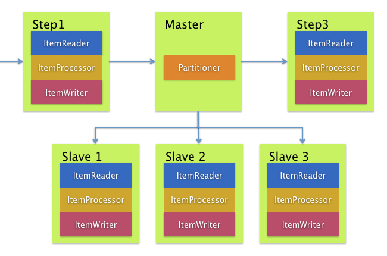
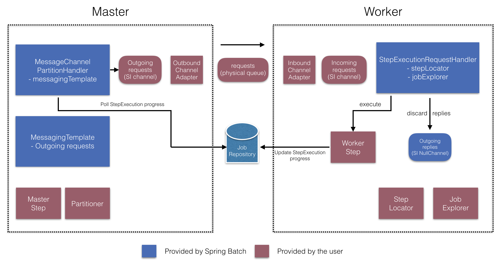
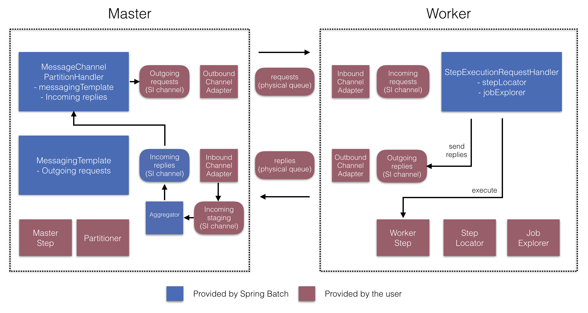

> [스프링 배치 공식 reference](https://docs.spring.io/spring-batch/docs/4.2.x/reference/html/index-single.html#springBatchIntegration)를 한글로 번역한 문서입니다.
>
> 전체 목차는 [여기](https://godekdls.github.io/Spring%20Batch/contents/)에 있습니다.

### 목차

- [13.1. Spring Batch Integration Introduction](#131-spring-batch-integration-introduction)
  + [13.1.1. Launching Batch Jobs through Messages](#1311-launching-batch-jobs-through-messages)
    * [Transforming a file into a JobLaunchRequest](#transforming-a-file-into-a-joblaunchrequest)
    * [The JobExecution Response](#the-jobexecution-response)
    * [Spring Batch Integration Configuration](#spring-batch-integration-configuration)
    * [Example ItemReader Configuration](#example-itemreader-configuration)
- [13.2. Available Attributes of the Job-Launching Gateway](#132-available-attributes-of-the-job-launching-gateway)
- [13.3. Sub-Elements](#133-sub-elements)
  + [13.3.1. Providing Feedback with Informational Messages](#1331-providing-feedback-with-informational-messages)
  + [13.3.2. Asynchronous Processors](#1332-asynchronous-processors)
  + [13.3.3. Externalizing Batch Process Execution](#1333-externalizing-batch-process-execution)
    * [Remote Chunking](#remote-chunking)
    * [Remote Partitioning](#remote-partitioning)

---

## 13.1. Spring Batch Integration Introduction

스프링 배치로 해결할 수 없는 일이
Spring Integration으로 간단히 해결될 때도 많다.
반대로 Spring Integration을 사용하다 스프링 배치가 필요할 때도 있으며,
이럴 땐 두 프레임워크를 효율적으로 통합할 방법이 필요하다.
이와 관련한 몇 가지 패턴과 사용 사례가 생겨났고,
Spring Batch Integration으로 이런 요구사항을 해결할 수 있다.

스프링 배치와 Spring Integration의 경계가 항상 명확하진 아니지만,
이 두 가지 원칙을 기억해두면 도움이 될 것이다.
잘게 쪼개서 생각하고, 공통 패턴을 적용해라.
이번 장에서는 공통 패턴 몇 가지를 다뤄볼 것이다. 

메세지를 보내 배치 프로세스 명령을 자동화하면 주요 관심사를 분리하고 전략화할 수 있다.
예를 들어 메세지 전송으로 job 실행을 트리거링하는 등, 다양한 방법으로 활용할 수 있다.
반대로 job이 완료되거나 실패하면 이 이벤트가 메세지 전송을 트리거링해서,
메세지 컨슈머가 어플리케이션 자체와는 관련 없는 다른 로직을 처리할 수도 있다.
또, job 안에서 메세지 처리를 할 수도 있다(예를 들어 채널로 아이템을 읽고 쓰는 경우).
remote partitioning과 remote chunking은 부하를 여러 워커에 분산시킨다.

이번 섹션에서 다루는 주요 개념은 다음과 같다:

- [Launching Batch Jobs through Messages](#1311-launching-batch-jobs-through-messages)
- [Providing Feedback with Informational Messages](#1331-providing-feedback-with-informational-messages)
- [Asynchronous Processors](#1332-asynchronous-processors)
- [Externalizing Batch Process Execution](#1333-externalizing-batch-process-execution)

### 13.1.1. Launching Batch Jobs through Messages

코어 스프링 배치 API는 두 가지 방법으로 배치 job을 시작한다:

- 커맨드라인에서 `CommandLineJobRunner` 사용
- 코드에서 `JobOperator.start()`나 `JobLauncher.run()` 호출

쉘 스크립트에서 `CommandLineJobRunner`로 배치를 실행하거나
직접 `JobOperator`를 사용해도 된다
(예를 들어 웹 어플리케이션에서 스프링 배치를 사용하고 있다면).
하지만 좀 더 복잡한 경우라면?
배치에서 데이터를 (S)FTP 서버에 주기적으로 폴링하거나
어플리케이션이 여러 데이터소스를 동시에 사용할 수도 있다.
예를 들어 데이터 파일을 웹에서뿐 아니라 FTP나 다른 곳에서 읽을 수도 있고,
스프링 배치를 시작하기 전 입력 파일을 추가적으로 변환해야 하는 경우도 있다.

이럴 때 쓸 훨씬 강력한 방법이 있는데,
Spring Integration과 여러 어댑터(adapter)로 배치 job을 시작하는 것이다.
예를 들어 *파일 인바운드 채널 어댑터*를 만들어 파일 시스템 디렉토리를 모니터링하면
입력 파일이 도착하자마자 배치를 시작할 수 있다.
또, 여러 어댑터를 사용해 Spring Integration 플로우를 만들면
배치 job은 동시에 여러 소스에서 데이터를 처리할 수 있다.
Spring Integration을 사용하면,
`JobLauncher`로 job을 이벤트 기반으로 나눠 실행할 수 있기 때문에
쉽게 이런 시나리오를 구현할 수 있다.

스프링 배치 Integration은 배치 job을 시작할 수 있는
`JobLaunchingMessageHandler` 클래스를 제공한다. 
Spring Integration 메세지가 `JobLaunchRequest` 타입 페이로드로
`JobLaunchingMessageHandler` 입력을 만든다. 
`JobLaunchRequest`는 실행할 `Job`과 실행에 필요한 `JobParameters`를 감싸고 있다.

아래 이미지는 배치 job을 실행하는 전형적인 Spring Integration 메세지를 보여준다.
전체 메세지 아이콘과 각 설명은
[The EIP (Enterprise Integration Patterns) website](https://www.enterpriseintegrationpatterns.com/patterns/messaging/toc.html)에 정리돼 있다.



#### Transforming a file into a JobLaunchRequest

```java
package io.spring.sbi;

import org.springframework.batch.core.Job;
import org.springframework.batch.core.JobParametersBuilder;
import org.springframework.batch.integration.launch.JobLaunchRequest;
import org.springframework.integration.annotation.Transformer;
import org.springframework.messaging.Message;

import java.io.File;

public class FileMessageToJobRequest {
    private Job job;
    private String fileParameterName;

    public void setFileParameterName(String fileParameterName) {
        this.fileParameterName = fileParameterName;
    }

    public void setJob(Job job) {
        this.job = job;
    }

    @Transformer
    public JobLaunchRequest toRequest(Message<File> message) {
        JobParametersBuilder jobParametersBuilder =
            new JobParametersBuilder();

        jobParametersBuilder.addString(fileParameterName,
            message.getPayload().getAbsolutePath());

        return new JobLaunchRequest(job, jobParametersBuilder.toJobParameters());
    }
}
```

#### The `JobExecution` Response

배치 job을 실행하면 `JobExecution` 인스턴스를 반환하며,
이 인스턴스로 실행 상태를 확인할 수 있다.
`JobExecution`을 만들 수만 있으면 실제로 job이 성공했는지와는 상관없이 항상 리턴한다. 

사용하는 `TaskExecutor`에 따라 `JobExecution` 인스턴스를 리턴하는 방법이 다르다.
*동기*(싱글 쓰레드) `TaskExecutor` 구현체를 사용한다면
job을 *완료한 후*에 `JobExecution`을 리턴한다.
*비동기* `TaskExecutor`는 즉시 `JobExecution`을 반환한다.
이때는 `JobExecution` 인스턴스 `id`를 가져와서(`JobExecution.getJobId()`)
`JobExplorer`로 `JobRepository`에 업데이트된 job 상태를 질의한다.
자세한 내용은 스프링 배치 레퍼런스
[Querying the Repository](https://godekdls.github.io/Spring%20Batch/configuringandrunningajob/#461-querying-the-repository)를 참고하라.

#### Spring Batch Integration Configuration

아래 설정은 `inbound-channel-adapter` 파일을 만들어서
설정한 디렉토리에 있는 CSV 파일을 폴링하고,
`FileMessageToJobRequest`로 전달해 메세지를 변환하고, 
*Job Launching Gateway*로 job을 실행하고,
`JobExecution` 결과를 `logging-channel-adapter`에 로깅한다.

```java
@Bean
public FileMessageToJobRequest fileMessageToJobRequest() {
    FileMessageToJobRequest fileMessageToJobRequest = new FileMessageToJobRequest();
    fileMessageToJobRequest.setFileParameterName("input.file.name");
    fileMessageToJobRequest.setJob(personJob());
    return fileMessageToJobRequest;
}

@Bean
public JobLaunchingGateway jobLaunchingGateway() {
    SimpleJobLauncher simpleJobLauncher = new SimpleJobLauncher();
    simpleJobLauncher.setJobRepository(jobRepository);
    simpleJobLauncher.setTaskExecutor(new SyncTaskExecutor());
    JobLaunchingGateway jobLaunchingGateway = new JobLaunchingGateway(simpleJobLauncher);

    return jobLaunchingGateway;
}

@Bean
public IntegrationFlow integrationFlow(JobLaunchingGateway jobLaunchingGateway) {
    return IntegrationFlows.from(Files.inboundAdapter(new File("/tmp/myfiles")).
                    filter(new SimplePatternFileListFilter("*.csv")),
            c -> c.poller(Pollers.fixedRate(1000).maxMessagesPerPoll(1))).
            handle(fileMessageToJobRequest()).
            handle(jobLaunchingGateway).
            log(LoggingHandler.Level.WARN, "headers.id + ': ' + payload").
            get();
}
```

#### Example ItemReader Configuration

이제 파일을 폴링해서 job을 실행시켰으니,
job 파라미터의 "input.file.name"에 정의한 파일을 읽을
스프링 배치 `ItemReader`를 설정해보겠다:

```java
@Bean
@StepScope
public ItemReader sampleReader(@Value("#{jobParameters[input.file.name]}") String resource) {
...
    FlatFileItemReader flatFileItemReader = new FlatFileItemReader();
    flatFileItemReader.setResource(new FileSystemResource(resource));
...
    return flatFileItemReader;
}
```

앞의 예제에서 주의 깊게 살펴봐야 할 점은
`ItemReader`를 step 스코프로 설정하고,
리소스 프로퍼티에 `#{jobParameters['input.file.name']}`을 주입했다는 것이다.
빈을 step 스코프로 설정해야 프로퍼티를 나중에 바인딩(late binding)하고
`jobParameters`에 접근할 수 있다.

---

## 13.2. Available Attributes of the Job-Launching Gateway

job-launching gateway는 다음과 같은 속성으로 job을 제어한다:

- `id`: 기본 스프링 빈 정의를 식별하며 두 가지 중 하나다: 
  + `EventDrivenConsumer`
  + `PollingConsumer` (정확한 구현은 입력 채널이 `SubscribableChannel`인지 `PollableChannel`에 따라 다르다.)
- `auto-startup`: job을 실행할 때 엔드포인트를 자동으로 시작해야 하는지 나타내는 boolean 플래그. 디폴트는 *true*다.
- `request-channel`: 엔드포인트의 입력 `MessageChannel`.
- `reply-channel`: 결과로 `JobExecution` 페이로드를 보낼 `MessageChannel`.
- `reply-timeout`: 게이트웨이가 reply 채널에 응답 메세지를 보내는 동안
얼마나(milliseconds) 기다릴지 설정한다. 이 제한을 넘어가면 exeption이 발생한다.
이 속성은 채널이 블락된 경우에만 유효하다 (예를 들어 사용 중인 큐가 다 찬 경우).
`DirectChannel`에 메세지를 보낸다면 sender의 쓰레드에서 받는다는 것에 주의해라.
따라서 메세지 전송에 실패했다면 다른 컴포넌트 다운스트림으로 인한 것일 수 있다.
`reply-timeout` 속성은 `MessagingTemplate` 인스턴스의
`sendTimeout` 프로퍼티에 매핑된다.
값을 지정하지 않으면 디폴트 값인 *-1*로 설정되는데, `Gateway`가 무기한 기다린다는 뜻이다.
- `job-launcher`: Optional. 
커스텀 `JobLauncher` 빈을 사용해도 된다.
지정하지 않으면 어댑터는 `jobLauncher` `id`로 등록한 인스턴스를 재사용한다.
디폴트 인스턴스가 없으면 예외를 던진다.
- `order`: 엔드포인트를 `SubscribableChannel` 구독자로 연결한 경우 실행 순서를 명시한다.

---

## 13.3. Sub-Elements

`Gateway`가 `PollableChannel`로 메세지를 받으려면
아래 예제처럼 `Job Launching Gateway`에 글로벌 디폴트 `Poller`를 지정하거나
`Poller` 하위 요소를 설정해야 한다.

```java
@Bean
@ServiceActivator(inputChannel = "queueChannel", poller = @Poller(fixedRate="1000"))
public JobLaunchingGateway sampleJobLaunchingGateway() {
    JobLaunchingGateway jobLaunchingGateway = new JobLaunchingGateway(jobLauncher());
    jobLaunchingGateway.setOutputChannel(replyChannel());
    return jobLaunchingGateway;
}
```

### 13.3.1. Providing Feedback with Informational Messages

어떤 스프링 배치 job은 오랫동안 실행될 수도 있기 때문에,
진행 정보를 확인하고 싶을 때가 있다.
예를 들어 배치 job의 일부나 전체가 실패했을 때 관련 담당자에게 통지하고 싶을 수 있다.
스프링 배치는 다음을 통해 정보를 수집할 수 있다: 

- Active polling
- Event-driven listeners

스프링 배치 job을 비동기로 시작하면 (예를 들어 `Job Launching Gateway`를 사용하는 경우)
`JobExecution` 인스턴스를 반환한다.
따라서 `JobExecution.getJobId()`를 사용해
`JobExplorer`로 `JobRepository`에 있는 업데이트된 `JobExecution` 인스턴스를
조회하는 식으로 상태를 주기적으로 폴링할 수 있다.
하지만 이건 차선책이고, 먼저 이벤트 지향으로 접근해 보는 게 좋다.

따라서 스프링 배치는 여러 리스너를 제공하며,
다음은 가장 많이 사용하는 리스너다: 

- StepListener
- ChunkListener
- JobExecutionListener

아래 그림에 보이는 예제는 `StepExecutionListener`를 사용한다.
따라서 Spring Integration은 step에서 발생한 모든 이벤트를 step 전후에 통지받는다.   
예를 들어 받은 `Router`로 `StepExecution` 상태에 따라 분기할 수 있다.
메일 아웃바운드 채널 어댑터에 메세지를 라우팅하면
특정 조건에 메일로 통지할 수 있다.



다음 두 예제는 `StepExecution` 이벤트를 `Gateway`에
메세지로 전송하고 결과를 `logging-channel-adapter`에 로깅하는
리스너를 설정한다.

먼저 통지를 위한 integration 빈을 정의한다:

```java
@Bean
@ServiceActivator(inputChannel = "stepExecutionsChannel")
public LoggingHandler loggingHandler() {
    LoggingHandler adapter = new LoggingHandler(LoggingHandler.Level.WARN);
    adapter.setLoggerName("TEST_LOGGER");
    adapter.setLogExpressionString("headers.id + ': ' + payload");
    return adapter;
}

@MessagingGateway(name = "notificationExecutionsListener", defaultRequestChannel = "stepExecutionsChannel")
public interface NotificationExecutionListener extends StepExecutionListener {}
```

> 설정에 `@IntegrationComponentScan` 애노테이션을 추가해야 한다. 

그다음, step 레벨 리스너를 job에 등록한다.

```java
public Job importPaymentsJob() {
    return jobBuilderFactory.get("importPayments")
        .start(stepBuilderFactory.get("step1")
                .chunk(200)
                .listener(notificationExecutionsListener())
                ...
}
```

### 13.3.2. Asynchronous Processors

아이템 처리는 비동기 프로세서로 확장할 수 있다.
비동기 프로세서를 사용하면, `AsyncItemProcessor`는 디스패처 역할을 하며
새 쓰레드에서 `ItemProcessor` 로직을 실행한다.
아이템을 다 처리하고 나면 `AsynchItemWriter`에 `Future`를 전송한다.

게다가 비동기로 아이템을 처리하면
fork-join을 사용할 수 있으므로 성능이 향상된다.
`AsyncItemWriter`는 결과를 모으고 있다가, 모든 아이템이 다 처리되면 청크로 write한다.

다음은 `AsyncItemProcessor`를 사용하는 예시이다:

```java
@Bean
public AsyncItemProcessor processor(ItemProcessor itemProcessor, TaskExecutor taskExecutor) {
    AsyncItemProcessor asyncItemProcessor = new AsyncItemProcessor();
    asyncItemProcessor.setTaskExecutor(taskExecutor);
    asyncItemProcessor.setDelegate(itemProcessor);
    return asyncItemProcessor;
}
```

`delegate`프로퍼티로 `ItemProcessor` 빈을 넘기고 
`taskExecutor` 프로퍼티로 원하는 `TaskExecutor`를 설정하면 된다.

다음은 `AsyncItemWriter`를 설정하는 방법이다:

```java
@Bean
public AsyncItemWriter writer(ItemWriter itemWriter) {
    AsyncItemWriter asyncItemWriter = new AsyncItemWriter();
    asyncItemWriter.setDelegate(itemWriter);
    return asyncItemWriter;
}
```

여기서도 마찬가지로 `delegate` 프로퍼티가 실제 `ItemWriter` 빈이다.

### 13.3.3. Externalizing Batch Process Execution

지금 까지 설명한 어플리케이션 통합 방법은 모두
Spring Integration이 스프링 배치를 감싸는 식이었다.
하지만 스프링 배치 내부에서도 Spring Integration을 사용할 수 있다.
이 방법을 사용하면 스프링 배치의 아이템 처리나 심지어 청크 처리까지
외부 프로세스로 위임할 수 있다.
이를 통해 복잡한 처리를 Spring Integration에 위임할 수 있다.
Spring Batch Integration은 다음 두 가지를 지원한다:

- Remote Chunking
- Remote Partitioning

#### Remote Chunking



한 단계 더 나아가서, 아이템을 전송하고 결과를 수집하는
`ChunkMessageChannelItemWriter`(Spring Batch Integration 제공)를 사용하면
청크 처리도 외부에서 할 수 있다.
스프링 배치는 일단 데이터를 보내고 나면
결과를 기다리지 않고 계속해서 아이템을 읽고 그룹화한다.
`ChunkMessageChannelItemWriter`가 결과를 모아 통합하고 스프링 배치 프로세스로 돌려준다.

Spring Integration을 사용하면 동시 처리를 완벽하게 제어할 수 있다
(예를 들어 `DirectChannel` 대신 `QueueChannel`을 사용함으로써).
게다가 스프링 배치의 풍부한 채널 어댑터(JMS나 AMQP같은)를 사용하면
청크를 외부 시스템으로 분산처리할 수 있다.

step에서 remote chunking을 사용하는 job은 아래와 유사하게 설정할 수 있다:

```java
public Job chunkJob() {
     return jobBuilderFactory.get("personJob")
             .start(stepBuilderFactory.get("step1")
                     .<Person, Person>chunk(200)
                     .reader(itemReader())
                     .writer(itemWriter())
                     .build())
             .build();
 }
```

`ItemReader`는 매니저에서 데이터를 읽을 때 사용하는 빈이다.
`ItemWriter`는 위에서 설명한 특별한 `ItemWriter`(`ChunkMessageChannelItemWriter`)를 가리킨다.
processor는(만약 있다면) 워커에서 사용하므로 매니저에는 설정하지 않는다.
다음은 기본적인 매니저를 설정해 보겠다.
실제로 사용할 때는 throttle limit 같은 다른 컴포넌트 프로퍼티도 함께 체크해라. 

```java
@Bean
public org.apache.activemq.ActiveMQConnectionFactory connectionFactory() {
    ActiveMQConnectionFactory factory = new ActiveMQConnectionFactory();
    factory.setBrokerURL("tcp://localhost:61616");
    return factory;
}

/*
 * Configure outbound flow (requests going to workers)
 */
@Bean
public DirectChannel requests() {
    return new DirectChannel();
}

@Bean
public IntegrationFlow outboundFlow(ActiveMQConnectionFactory connectionFactory) {
    return IntegrationFlows
            .from(requests())
            .handle(Jms.outboundAdapter(connectionFactory).destination("requests"))
            .get();
}

/*
 * Configure inbound flow (replies coming from workers)
 */
@Bean
public QueueChannel replies() {
    return new QueueChannel();
}

@Bean
public IntegrationFlow inboundFlow(ActiveMQConnectionFactory connectionFactory) {
    return IntegrationFlows
            .from(Jms.messageDrivenChannelAdapter(connectionFactory).destination("replies"))
            .channel(replies())
            .get();
}

/*
 * Configure the ChunkMessageChannelItemWriter
 */
@Bean
public ItemWriter<Integer> itemWriter() {
    MessagingTemplate messagingTemplate = new MessagingTemplate();
    messagingTemplate.setDefaultChannel(requests());
    messagingTemplate.setReceiveTimeout(2000);
    ChunkMessageChannelItemWriter<Integer> chunkMessageChannelItemWriter
            = new ChunkMessageChannelItemWriter<>();
    chunkMessageChannelItemWriter.setMessagingOperations(messagingTemplate);
    chunkMessageChannelItemWriter.setReplyChannel(replies());
    return chunkMessageChannelItemWriter;
}
```

위 설정에선 빈을 여러 개 정의했는데,
ActiveMQ와 Spring Integration이 제공하는 인바운드/아웃바운드 JMS 어댑터로
메세지 미들웨어를 설정했다.
위 step에서 참조하고 있는 `itemWriter`는
설정한 미들웨어로 청크를 쓰기 위해 `ChunkMessageChannelItemWriter`를 사용했다. 

이제 워커 설정으로 넘어가서, 아래 예제를 보자:

```java
@Bean
public org.apache.activemq.ActiveMQConnectionFactory connectionFactory() {
    ActiveMQConnectionFactory factory = new ActiveMQConnectionFactory();
    factory.setBrokerURL("tcp://localhost:61616");
    return factory;
}

/*
 * Configure inbound flow (requests coming from the manager)
 */
@Bean
public DirectChannel requests() {
    return new DirectChannel();
}

@Bean
public IntegrationFlow inboundFlow(ActiveMQConnectionFactory connectionFactory) {
    return IntegrationFlows
            .from(Jms.messageDrivenChannelAdapter(connectionFactory).destination("requests"))
            .channel(requests())
            .get();
}

/*
 * Configure outbound flow (replies going to the manager)
 */
@Bean
public DirectChannel replies() {
    return new DirectChannel();
}

@Bean
public IntegrationFlow outboundFlow(ActiveMQConnectionFactory connectionFactory) {
    return IntegrationFlows
            .from(replies())
            .handle(Jms.outboundAdapter(connectionFactory).destination("replies"))
            .get();
}

/*
 * Configure the ChunkProcessorChunkHandler
 */
@Bean
@ServiceActivator(inputChannel = "requests", outputChannel = "replies")
public ChunkProcessorChunkHandler<Integer> chunkProcessorChunkHandler() {
    ChunkProcessor<Integer> chunkProcessor
            = new SimpleChunkProcessor<>(itemProcessor(), itemWriter());
    ChunkProcessorChunkHandler<Integer> chunkProcessorChunkHandler
            = new ChunkProcessorChunkHandler<>();
    chunkProcessorChunkHandler.setChunkProcessor(chunkProcessor);
    return chunkProcessorChunkHandler;
}
```

설정 대부분이 매니저 설정과 비슷하다.
워커는 스프링 배치 `JobRepository`나 실제 job 설정 파일에 접근할 필요가 없다.
가장 중요한 빈은 `chunkProcessorChunkHandler`다.
`chunkProcessor` 프로퍼티로 `ChunkProcessorChunkHandler`에
`SimpleChunkProcessor`를 넘겨줬는데,
매니저로부터 청크를 받으면 이 `SimpleChunkProcessor`로
워커에서 실행할 `ItemWriter`를(원한다면 `ItemProcessor`도) 참조한다.

더 자세한 내용은
[Remote Chunking](https://godekdls.github.io/Spring%20Batch/scalingandparallelprocessing/#73-remote-chunking) 의
"Scalability" 섹션을 참고하라.

Spring Batch Integration은 4.1 버전부터
`@EnableBatchIntegration` 애노테이션으로
간단하게 remote chunking을 설정할 수 있다.
이 애노테이션은 어플리케이션 컨텍스트에 주입할 수 있는 빈 두 개를 제공한다:

- `RemoteChunkingManagerStepBuilderFactory`: 매니저 step을 만들 때 사용
- `RemoteChunkingWorkerBuilder`: 리모트 워커 플로우를 만들 때 사용

이 둘을 사용하면 아래 다이어그램에 나오는 여러 컴포넌트를 구성할 수 있다:



매니저 step을 만들 때는
`RemoteChunkingManagerStepBuilderFactory`로 다음을 설정할 수 있다:

- 아이템을 읽어서 워커에 전달할 item reader
- 워커에 요청을 전송하는 출력 채널("Outgoing requests")
- 워커에게 응답을 받는 입력 채널("Incoming replies")

`ChunkMessageChannelItemWriter`와 `MessagingTemplate`은
명시적으로 설정하지 않아도 된다 (필요하면 설정할 수는 있다).

`RemoteChunkingWorkerBuilder`로 워커가 다음과 같은 일을 하도록 설정할 수 있다:

- 매니저가 입력 채널("Incoming requests")에 보낸 요청 수신
- 각 요청마다 `ItemProcessor`와 `ItemWriter`를 가지고 있는
`ChunkProcessorChunkHandler`의 `handleChunk` 메소드 호출
- 매니저에게 출력 채널("Outgoing replies")로 응답 전송

`SimpleChunkProcessor`와 `ChunkProcessorChunkHandler`는
명시적으로 설정하지 않아도 된다 (필요하면 설정할 수는 있다).

아래는 이 API를 사용하는 예제이다:

```java
@EnableBatchIntegration
@EnableBatchProcessing
public class RemoteChunkingJobConfiguration {

    @Configuration
    public static class ManagerConfiguration {

        @Autowired
        private RemoteChunkingManagerStepBuilderFactory managerStepBuilderFactory;

        @Bean
        public TaskletStep managerStep() {
            return this.managerStepBuilderFactory.get("managerStep")
                       .chunk(100)
                       .reader(itemReader())
                       .outputChannel(requests()) // requests sent to workers
                       .inputChannel(replies())   // replies received from workers
                       .build();
        }

        // Middleware beans setup omitted

    }

    @Configuration
    public static class WorkerConfiguration {

        @Autowired
        private RemoteChunkingWorkerBuilder workerBuilder;

        @Bean
        public IntegrationFlow workerFlow() {
            return this.workerBuilder
                       .itemProcessor(itemProcessor())
                       .itemWriter(itemWriter())
                       .inputChannel(requests()) // requests received from the manager
                       .outputChannel(replies()) // replies sent to the manager
                       .build();
        }

        // Middleware beans setup omitted

    }

}
```

remote chunking job을 사용하는 좀 더 복잡한 예제는
[여기](https://github.com/spring-projects/spring-batch/tree/master/spring-batch-samples#remote-chunking-sample)를 참고하라.

#### Remote Partitioning



반대로 Remote Partitioning은 아이템 처리가 아니라 I/O가 병목일 때 유용하다. 
Remote Partitioning을 사용하면 각 워커에게 스프링 배치 step을 통째로 맡길 수 있다.
각 워커마다 `ItemReader`, `ItemProcessor`, `ItemWriter`를 따로 가지고 있다.
스프링 배치는 이를 위한 `MessageChannelPartitionHandler`를 제공한다.

이 `PartitionHandler` 구현체는 `MessageChannel` 인스턴스를 사용해서
리모트 워커에게 요청을 보내고 결과를 수신한다.
리모트 워커와 통신하는 데 사용하는 전송수단(JMS나 AMQP같은)을 추상화했다.

"Scalability" 섹션에서
[remote partitioning](https://godekdls.github.io/Spring%20Batch/scalingandparallelprocessing/#74-partitioning)을 설명하면서 기본 개념과 필요한 설정을 정리했고,
로컬에서 여러 쓰레드를 실행하는
디폴트 `TaskExecutorPartitionHandler`를 사용한 예제를 다뤘다.
remote partitioning을 여러 JVM에서 사용하려면 두 가지가 더 필요하다: 

- 원격 fabric 혹은  그리드 환경
- 원하는 fabric이나 그리드 환경을 지원하는 `PartitionHandler` 구현체

remote chunking과 유사하게 JMS를 "remoting fabric"으로 사용할 수 있다.
이런 경우 아래 예제처럼
`PartitionHandler` 구현체는 `MessageChannelPartitionHandler`를 사용한다.
아래 예제는 파티셔닝된 job이 있다고 가정하고
`MessageChannelPartitionHandler`와 JMS 설정에 집중한다.

```java
/*
 * Configuration of the manager side
 */
@Bean
public PartitionHandler partitionHandler() {
    MessageChannelPartitionHandler partitionHandler = new MessageChannelPartitionHandler();
    partitionHandler.setStepName("step1");
    partitionHandler.setGridSize(3);
    partitionHandler.setReplyChannel(outboundReplies());
    MessagingTemplate template = new MessagingTemplate();
    template.setDefaultChannel(outboundRequests());
    template.setReceiveTimeout(100000);
    partitionHandler.setMessagingOperations(template);
    return partitionHandler;
}

@Bean
public QueueChannel outboundReplies() {
    return new QueueChannel();
}

@Bean
public DirectChannel outboundRequests() {
    return new DirectChannel();
}

@Bean
public IntegrationFlow outboundJmsRequests() {
    return IntegrationFlows.from("outboundRequests")
            .handle(Jms.outboundGateway(connectionFactory())
                    .requestDestination("requestsQueue"))
            .get();
}

@Bean
@ServiceActivator(inputChannel = "inboundStaging")
public AggregatorFactoryBean partitioningMessageHandler() throws Exception {
    AggregatorFactoryBean aggregatorFactoryBean = new AggregatorFactoryBean();
    aggregatorFactoryBean.setProcessorBean(partitionHandler());
    aggregatorFactoryBean.setOutputChannel(outboundReplies());
    // configure other propeties of the aggregatorFactoryBean
    return aggregatorFactoryBean;
}

@Bean
public DirectChannel inboundStaging() {
    return new DirectChannel();
}

@Bean
public IntegrationFlow inboundJmsStaging() {
    return IntegrationFlows
            .from(Jms.messageDrivenChannelAdapter(connectionFactory())
                    .configureListenerContainer(c -> c.subscriptionDurable(false))
                    .destination("stagingQueue"))
            .channel(inboundStaging())
            .get();
}

/*
 * Configuration of the worker side
 */
@Bean
public StepExecutionRequestHandler stepExecutionRequestHandler() {
    StepExecutionRequestHandler stepExecutionRequestHandler = new StepExecutionRequestHandler();
    stepExecutionRequestHandler.setJobExplorer(jobExplorer);
    stepExecutionRequestHandler.setStepLocator(stepLocator());
    return stepExecutionRequestHandler;
}

@Bean
@ServiceActivator(inputChannel = "inboundRequests", outputChannel = "outboundStaging")
public StepExecutionRequestHandler serviceActivator() throws Exception {
    return stepExecutionRequestHandler();
}

@Bean
public DirectChannel inboundRequests() {
    return new DirectChannel();
}

public IntegrationFlow inboundJmsRequests() {
    return IntegrationFlows
            .from(Jms.messageDrivenChannelAdapter(connectionFactory())
                    .configureListenerContainer(c -> c.subscriptionDurable(false))
                    .destination("requestsQueue"))
            .channel(inboundRequests())
            .get();
}

@Bean
public DirectChannel outboundStaging() {
    return new DirectChannel();
}

@Bean
public IntegrationFlow outboundJmsStaging() {
    return IntegrationFlows.from("outboundStaging")
            .handle(Jms.outboundGateway(connectionFactory())
                    .requestDestination("stagingQueue"))
            .get();
}
```

아래 예제처럼 반드시 이 `partitionHandler` 빈을
파티션 `handler` 속성으로 매핑해야 한다:

```java
	public Job personJob() {
		return jobBuilderFactory.get("personJob")
				.start(stepBuilderFactory.get("step1.manager")
						.partitioner("step1.worker", partitioner())
						.partitionHandler(partitionHandler())
						.build())
				.build();
	}
```

remote partitioning job을 사용하는 좀 더 복잡한 예제는
[여기](https://github.com/spring-projects/spring-batch/tree/master/spring-batch-samples#remote-partitioning-sample)를 참고하라.

`@EnableBatchIntegration` 애노테이션으로 remote partitioning 설정을
더 단순하게 만들 수 있다.
이 애노테이션은 remote partitioning에 유용하게 쓸 수 있는 빈 두 개를 제공한다: 

- `RemotePartitioningManagerStepBuilderFactory`: 매니저 step을 만들 때 사용
- `RemotePartitioningWorkerStepBuilderFactory`: 워커 step을 만들 때 사용

이 둘을 사용하면 아래 다이어그램에 나오는 여러 컴포넌트를 구성할 수 있다:





매니저 step을 만들 때는
`RemotePartitioningManagerStepBuilderFactory`로 다음을 설정할 수 있다:

- 데이터를 나눌 때 사용하는 `Partitioner`
- 워커에 요청을 전송하는 출력 채널("Outgoing requests")
- 워커에게 응답을 받는 입력 채널("Incoming replies")
(replies aggregation을 설정하는 경우)
- 폴링 간격과 타임아웃 파라미터 (job 레포지토리 폴링을 설정한 경우)

`MessageChannelPartitionHandler`와 `MessagingTemplate`은
명시적으로 설정하지 않아도 된다 (필요하면 설정할 수는 있다).

`RemotePartitioningWorkerStepBuilderFactory`로
워커가 다음과 같은 일을 하도록 설정할 수 있다:

- 매니저가 입력 채널("Incoming requests")에 보낸 요청 수신
- 각 요청마다 `StepExecutionRequestHandler`의 `handle` 메소드 호출
- 매니저에게 출력 채널("Outgoing replies")로 응답 전송

`StepExecutionRequestHandler`는
명시적으로 설정하지 않아도 된다 (필요하면 설정할 수는 있다).

아래는 이 API를 사용하는 예제이다:

```java
@Configuration
@EnableBatchProcessing
@EnableBatchIntegration
public class RemotePartitioningJobConfiguration {

    @Configuration
    public static class ManagerConfiguration {

        @Autowired
        private RemotePartitioningManagerStepBuilderFactory managerStepBuilderFactory;

        @Bean
        public Step managerStep() {
                 return this.managerStepBuilderFactory
                    .get("managerStep")
                    .partitioner("workerStep", partitioner())
                    .gridSize(10)
                    .outputChannel(outgoingRequestsToWorkers())
                    .inputChannel(incomingRepliesFromWorkers())
                    .build();
        }

        // Middleware beans setup omitted

    }

    @Configuration
    public static class WorkerConfiguration {

        @Autowired
        private RemotePartitioningWorkerStepBuilderFactory workerStepBuilderFactory;

        @Bean
        public Step workerStep() {
                 return this.workerStepBuilderFactory
                    .get("workerStep")
                    .inputChannel(incomingRequestsFromManager())
                    .outputChannel(outgoingRepliesToManager())
                    .chunk(100)
                    .reader(itemReader())
                    .processor(itemProcessor())
                    .writer(itemWriter())
                    .build();
        }

        // Middleware beans setup omitted

    }

}
```

---

> 전체 목차는 [여기](https://godekdls.github.io/Spring%20Batch/contents/)에 있습니다.
