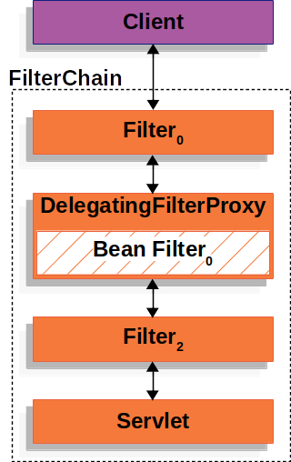

> [스프링 시큐리티 공식 레퍼런스](https://docs.spring.io/spring-security/site/docs/5.3.2.RELEASE/reference/html5/#servlet-architecture)를 한글로 번역한 문서입니다.
>
> 전체 목차는 [여기](../contents/)에 있습니다.



### 목차:

- [9.1. A Review of Filters](#91-a-review-of-filters)
- [9.2. DelegatingFilterProxy](#92-delegatingfilterproxy)
- [9.3. FilterChainProxy](#93-filterchainproxy)
- [9.4. SecurityFilterChain](#94-securityfilterchain)
- [9.5. Security Filters](#95-security-filters)
- [9.6. Handling Security Exceptions](#96-handling-security-exceptions)

---

이번 섹션에선 서블릿 기반 어플리케이션에서 사용하는 스프링 시큐리티의 고수준 아키텍처를 다룬다. [인증](../authentication), [인가](../authorization), [취약점 공격 방어](https://docs.spring.io/spring-security/site/docs/5.3.2.RELEASE/reference/html5/#servlet-exploits) 섹션에서 하나씩 심도 있게 살펴볼 것이다.

---

## 9.1. A Review of `Filter`s

스프링 시큐리티는 서블릿 `Filter`를 기반으로 서블릿을 지원하므로, 먼저 일반적인 `Filter` 역할을 살펴보면 이해하기 좀 더 쉬울 것이다. 아래 이미지는 단일 HTTP 요청을 처리하는 전형적인 레이어를 나타내고 있다:


클라이언트는 어플리케이션으로 요청을 전송하고, 컨테이너는 `Servlet`과 여러 `Filter`로 구성된 `FilterChain`을 만들어 요청 URI path 기반으로 `HttpServletRequest`를 처리한다. 스프링 MVC 어플리케이션에서의 `Servlet`은 [`DispatcherServlet`](https://docs.spring.io/spring/docs/current/spring-framework-reference/web.html#mvc-servlet)이다. 단일 `HttpServletRequest`와 `HttpServletResponse` 처리는 최대 한 개의 `Servlet`이 담당한다. 하지만 `Filter`는 여러 개를 사용할 수 있다. `Filter`의 사용 예는 다음과 같다:

- 다운스트림의 `Servlet`과 여러 `Filter`의 실행을 막는다. 이 경우엔 보통 `Filter`에서 `HttpServletResponse`를 작성한다.
- 다운스트림에 있는 `Servlet`과 여러 `Filter`들로 `HttpServletRequest`나 `HttpServletResponse`를 수정한다.

`Filter`는 `FilterChain` 안에 있을 때 효력을 발휘한다.

**Example 47. `FilterChain` Usage Example**

```java
public void doFilter(ServletRequest request, ServletResponse response, FilterChain chain) {
    // do something before the rest of the application
    chain.doFilter(request, response); // invoke the rest of the application
    // do something after the rest of the application
}
```

`Filter`는 다운스트림에 있는 나머지 `Filter`와 `Servlet`에만 영향을 주기 때문에, `Filter`의 실행 순서는 더할 나위 없이 중요하다.

---

## 9.2. DelegatingFilterProxy

스프링 부트는 [`DelegatingFilterProxy`](https://docs.spring.io/spring-framework/docs/current/javadoc-api/org/springframework/web/filter/DelegatingFilterProxy.html)라는 `Filter` 구현체로 서블릿 컨테이너의 생명주기와 스프링의 `ApplicationContext`를 연결한다. 서블릿 컨테이너는 자체 표준을 사용해서 `Filter`를 등록할 수 있지만, 스프링이 정의하는 빈은 인식하지 못한다. `DelegatingFilterProxy`는 표준 서블릿 컨테이너 메커니즘으로 등록할 수 있으면서도, 모든 처리를 `Filter`를 구현한 스프링 빈으로 위임해 준다.

여기 있는 그림은 `DelegatingFilterProxy`가 어떻게 [여러 `Filter`로 구성된 `FilterChain`](#91-a-review-of-filters)에 껴들어 가는지 보여준다.<span id="servlet-delegatingfilterproxy-figure"></span>



`DelegatingFilterProxy`는 `ApplicationContext`에서 *Bean Filter<sub>0</sub>*을 찾아 실행한다. 다음은 `DelegatingFilterProxy`의 슈도코드다.

**Example 48. `DelegatingFilterProxy` Pseudo Code**

```java
public void doFilter(ServletRequest request, ServletResponse response, FilterChain chain) {
    // Lazily get Filter that was registered as a Spring Bean
    // For the example in DelegatingFilterProxy delegate is an instance of Bean Filter0
    Filter delegate = getFilterBean(someBeanName);
    // delegate work to the Spring Bean
    delegate.doFilter(request, response);
}
```

`DelegatingFilterProxy`를 사용하면 `Filter` 빈 인스턴스를 찾는 것을 지연시킬 수도 있다. 컨테이너 기동 전에  `Filter`를 등록해야 하기 때문에 중요한 기능이다. 하지만 스프링은 보통 `Filter` 인스턴스들을 등록한 이후에 필요한 스프링 빈은 `ContextLoaderListener`로 로드한다.

----

## 9.3. FilterChainProxy

스프링 시큐리티는 `FilterChainProxy`로 서블릿을 지원한다. `FilterChainProxy`는 스프링 시큐리티가 제공하는 특별한 `Filter`로, [`SecurityFilterChain`](#94-securityfilterchain)을 통해 여러 `Filter` 인스턴스로 위임할 수 있다. `FilterChainProxy`는 빈이기 때문에 보통 [DelegatingFilterProxy](#92-delegatingfilterproxy)로 감싸져 있다.


---

## 9.4. SecurityFilterChain

[FilterChainProxy](#93-filterchainproxy)가 요청에 사용할 스프링 시큐리티의 `Filter`들을 선택할 땐 [`SecurityFilterChain`](https://docs.spring.io/spring-security/site/docs/current/api/org/springframework/security/web/SecurityFilterChain.html)을 사용한다. 


`SecurityFilterChain`에 있는 [보안 필터들](#95-security-filters)은 전형적인 빈이지만, [DelegatingFilterProxy](#92-delegatingfilterproxy)가 아닌 `FilterChainProxy`로 등록한다. `FilterChainProxy`로 서블릿 컨테이너나 [DelegatingFilterProxy](#92-delegatingfilterproxy)에 직접 빈을 등록하면 여러 가지 장점이 있다. 먼저 스프링 시큐리티가 서블릿을 지원할 수 있는 시작점 역할을 한다. 따라서 서블릿에 스프링 시큐리티를 적용하다 문제를 겪는다면 `FilterChainProxy`부터 디버그 포인트를 추가해 보는 것이 좋다.

`FilterChainProxy`는 스프링 시큐리티의 중심점이기 때문에 필수로 여겨지는 작업을 수행할 수 있다는 장점도 있다. 예를 들어 `SecurityContext`를 비워 메모리 릭을 방지할 수 있다. 스프링 시큐리티의 [`HttpFirewall`](https://docs.spring.io/spring-security/site/docs/5.3.2.RELEASE/reference/html5/#servlet-httpfirewall)을 적용해서 특정 공격 유형을 방어할 수도 있다.

게다가 `SecurityFilterChain`을 어떨 때 실행해야 할지도 좀 더 유연하게 결정할 수 있다. 서블릿 컨테이너에선 URL로만 실행할 `Filter`들을 결정한다. 하지만 `FilterChainProxy`는 `RequestMatcher` 인터페이스를 사용하면  `HttpServletRequest`에 있는 어떤 것으로도 실행 여부를 결정할 수 있다.

사실 사용할 `SecurityFilterChain`을 결정할 때도 `FilterChainProxy`를 사용한다. 이 덕분에 어플리케이션에선 완전히 설정을 분리해서 여러 *슬라이스*를 구성할 수 있다.


이 이미지에는 `SecurityFilterChain`이 여러 개 있다. 어떤 `SecurityFilterChain`을 사용할지는 `FilterChainProxy`가 결정하며, 가장 먼저 매칭한 `SecurityFilterChain`을 실행한다. `/api/messages/` URL을 요청하면 `SecurityFilterChain`<sub>0</sub>의 `/api/**` 패턴과 제일 먼저 매칭되므로, `SecurityFilterChain`<sub>n</sub>도 일치하긴 하지만 `SecurityFilterChain`<sub>0</sub>만 실행한다. `/messages/` URL로 요청하면, `SecurityFilterChain`<sub>0</sub>의 `/api/**` 패턴과는 매칭되지 않기 때문에 `FilterChainProxy`는 계속해서 다른 `SecurityFilterChain`을 시도해 본다. 매칭되는 다른 `SecurityFilterChain` 인스턴스가 없다고 가정하면, `SecurityFilterChain`<sub>n</sub>을 실행한다.

`SecurityFilterChain`<sub>0</sub>은 보안 `Filter` 인스턴스를 세 개만 설정했다는 점에 주목하라. 하지만 `SecurityFilterChain`<sub>n</sub>은 보안 `Filter`를 4개 설정했다. `SecurityFilterChain`은 유니크하고 격리된 상태로 설정할 수 있다는 점을 알아야 한다. 사실 어플리케이션에서 스프링 시큐리티가 특정 요청을 무시하길 바란다면,  `SecurityFilterChain`에 보안 `Filter`를 0개 설정하는 것도 가능하다.

---

## 9.5. Security Filters

보안 필터는 [SecurityFilterChain](#94-securityfilterchain) API를 사용해서 [FilterChainProxy](#93-filterchainproxy)에 추가한다. 이때 [`Filter`의 순서](#91-a-review-of-filters)가 중요하다. 보통은 스프링 시큐리티의 `Filter` 순서를 알아야 할 필요는 없다. 하지만 순서를 알아두면 좋을 때도 있다.

다음은 전체 스프링 시큐리티 필터의 순서를 나타낸 것이다:

- ChannelProcessingFilter
- ConcurrentSessionFilter
- WebAsyncManagerIntegrationFilter
- SecurityContextPersistenceFilter
- HeaderWriterFilter
- CorsFilter
- CsrfFilter
- LogoutFilter
- OAuth2AuthorizationRequestRedirectFilter
- Saml2WebSsoAuthenticationRequestFilter
- X509AuthenticationFilter
- AbstractPreAuthenticatedProcessingFilter
- CasAuthenticationFilter
- OAuth2LoginAuthenticationFilter
- Saml2WebSsoAuthenticationFilter
- [`UsernamePasswordAuthenticationFilter`](../authentication/#servlet-authentication-usernamepasswordauthenticationfilter)
- ConcurrentSessionFilter
- OpenIDAuthenticationFilter
- DefaultLoginPageGeneratingFilter
- DefaultLogoutPageGeneratingFilter
- [`DigestAuthenticationFilter`](../authentication#10103-digest-authentication)
- BearerTokenAuthenticationFilter
- [`BasicAuthenticationFilter`](../authentication#10102-basic-authentication)
- RequestCacheAwareFilter
- SecurityContextHolderAwareRequestFilter
- JaasApiIntegrationFilter
- RememberMeAuthenticationFilter
- AnonymousAuthenticationFilter
- OAuth2AuthorizationCodeGrantFilter
- SessionManagementFilter
- [`ExceptionTranslationFilter`](#96-handling-security-exceptions)
- [`FilterSecurityInterceptor`](../authorization#112-authorize-httpservletrequest-with-filtersecurityinterceptor)
- SwitchUserFilter

---

## 9.6. Handling Security Exceptions

[`ExceptionTranslationFilter`](https://docs.spring.io/spring-security/site/docs/current/api/org/springframework/security/web/access/ExceptionTranslationFilter.html)는 [`AccessDeniedException`](https://docs.spring.io/spring-security/site/docs/current/api/org/springframework/security/access/AccessDeniedException.html)을 해석하고 [`AuthenticationException`](https://docs.spring.io/spring-security/site/docs/current/api//org/springframework/security/core/AuthenticationException.html)을 HTTP 응답으로 바꿔준다.

`ExceptionTranslationFilter`는 [FilterChainProxy](#93-filterchainproxy)에 하나의 [보안 필터](#95-security-filters)로 추가된다.


- <span style="background-color: #a9dcfc; border-radius: 50px;">(1)</span> 먼저 `ExceptionTranslationFilter`는 `FilterChain.doFilter(request, response)`를 호출해서 어플리케이션의 나머지 로직을 실행한다.
- <span style="background-color: #a9dcfc; border-radius: 50px;">(2)</span> 인증받지 않은 사용자였거나 `AuthenticationException`이 발생했다면, *인증을 시작한다*.
  - [SecurityContextHolder](../authentication#101-securitycontextholder)를 비운다.
  - [`RequestCache`](https://docs.spring.io/spring-security/site/docs/current/api/org/springframework/security/web/savedrequest/RequestCache.html)에 `HttpServletRequest`를 저장한다. 사용자 인증에 성공하면 `RequestCache`로 기존 요청 처리를 이어간다.
  - `AuthenticationEntryPoint`는 클라이언트에 credential을 요청할 때 사용한다. 예를 들어 로그인 페이지로 리다이렉트하거나 `WWW-Authenticate` 헤더를 전송한다.
- <span style="background-color: #a9dcfc; border-radius: 50px;">(3)</span> 반대로 `AccessDeniedException`이었다면, *접근을 거부한다*. 거절된 요청은 `AccessDeniedHandler`에서 처리한다.

>  어플리케이션에서 `AccessDeniedException`이나 `AuthenticationException`을 던지지 않으면 `ExceptionTranslationFilter`는 아무 일도 하지 않는다.

`ExceptionTranslationFilter`의 슈도코드는 다음과 같다:

**ExceptionTranslationFilter pseudocode**

```java
try {
    filterChain.doFilter(request, response); //(1)
} catch (AccessDeniedException | AuthenticationException e) {
    if (!authenticated || e instanceof AuthenticationException) {
        startAuthentication(); // (2)
    } else {
        accessDenied(); // (3)
    }
}
```
<small><span style="background-color: #a9dcfc; border-radius: 50px;">(1)</span> [A Review of `Filter`s](#91-a-review-of-filters) 섹션에서 `FilterChain.doFilter(request, response)` 호출해서 어플리케이션의 나머지 작업을 이어 처리한다고 했던 게 기억날 것이다. 즉, 어플리케이션의 다른 곳에서 (i.e. [`FilterSecurityInterceptor`](../authorization#112-authorize-httpservletrequest-with-filtersecurityinterceptor) 또는 메소드 시큐리티) `AuthenticationException`이나 `AccessDeniedException`이 발생하면 여기서 예외를 캐치하고 처리한다.</small><br>
<small><span style="background-color: #a9dcfc; border-radius: 50px;">(2)</span> 인증받지 않은 사용자거나 `AuthenticationException`이 발생했다면 *인증을 시작한다*.</small><br>
<small><span style="background-color: #a9dcfc; border-radius: 50px;">(3)</span> 그렇지 않으면 *접근을 거부한다*.</small>

---

전체 목차는 [여기](../contents/)에 있습니다.

